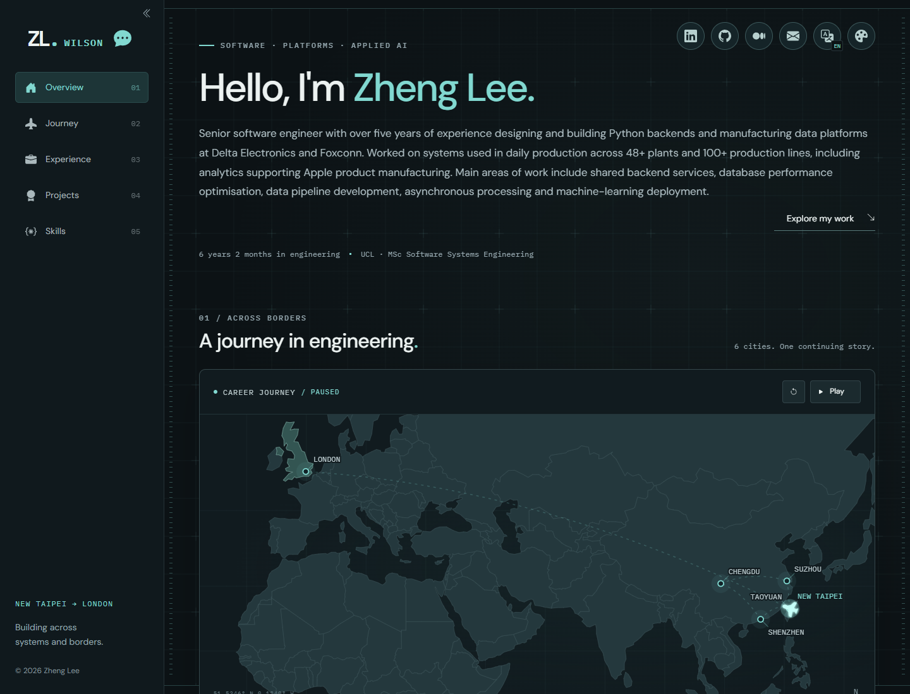
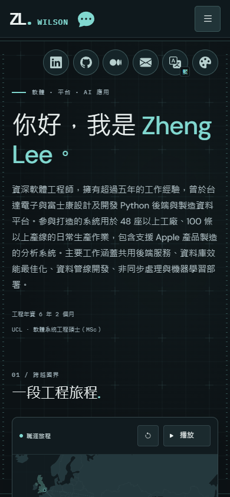

# Zheng Lee — Engineering Journey

A multilingual, offline-first engineering portfolio built with modular JavaScript, CSS and localized JSON data.

以模組化 JavaScript、CSS 與多語 JSON 資料打造的工程師作品集，支援完整離線瀏覽。

[English](#english) · [繁體中文](#繁體中文) · [Hosted site / 網站預覽](https://zheng-lee-engineering-journey.wilson19950315.chatgpt.site) · [API specification / API 規格](spec/README.md)



<details>
<summary>Mobile preview / 手機版預覽</summary>



</details>

## English

### About

This portfolio presents Zheng Lee's engineering background through an interactive career map, experience timeline, project details and skills. It is a static application with explicit module boundaries and a mock API layer designed for gradual backend integration.

The application runs without a frontend framework, CDN or runtime package installation. Fonts, Bootstrap SVG icons, the map and the illustration are bundled locally. The hosted preview follows its existing access permissions; the offline build does not require access to that host.

### Features

- English, Simplified Chinese and Traditional Chinese content, with persistent language selection.
- Interactive journey map with geographic positioning, animated travel, city details and a scrollable destination strip.
- Experience and project lists loaded six records at a time, with retry controls and cached expansion.
- Complete project dialogs and reusable skill chips that fit their available width.
- Sliding mobile navigation and a collapsible desktop icon rail with hover/focus labels.
- Mint, Ice, Amber and light Mist themes; background speed, intensity and pause preferences persist locally.
- An internship chat bubble with staged entrance, hover/focus retention and a three-second idle dismissal.
- Keyboard interactions, reduced-motion support and responsive layouts from phones to 4K viewports.

The [feature inventory](docs/current-page-features.md) documents 55 features across nine areas.

### Run locally

Clone or download the repository and work from its root directory.

**View the existing build:** open `dist/index.html` directly in a modern browser. No server or installation is needed. External social links still need internet access; email links use the device's mail application.

**Develop:** install Node.js 22 or newer, then run:

```sh
node scripts/build.mjs
node scripts/serve.cjs
```

Open `http://127.0.0.1:4173`. Stop the preview with Ctrl+C. The build uses Node's standard library; `npm install` is not required. Source changes require another build; the preview server does not provide hot reload.

### Customize

| Change                                     | Edit                                             |
| ------------------------------------------ | ------------------------------------------------ |
| Brand, profile, social links, chat message | `mock/site/{locale}.json`                        |
| Career map and dates                       | `mock/journey/{locale}.json`                     |
| Experience cards                           | `mock/experiences/{locale}.json`                 |
| Projects, complete details and skills      | `mock/projects/{locale}.json`                    |
| Skill categories and their labels          | `mock/skills.json`, `mock/locales/{locale}.json` |
| Fixed UI translations                      | `src/locales/{locale}.json`                      |
| Navigation and runtime defaults            | `src/config/`                                    |
| Theme colors, typography and shared tokens | `src/styles/theme.css`                           |

Locale filenames use `en`, `zh-Hans` and `zh-Hant`. Preserve the same numeric record IDs, order and totals across languages. Content is plain text; use normal line breaks rather than HTML or Markdown. See [mock field comments](mock/README.md).

After editing data, update `config/build.json`'s mock revision and rebuild. Register new modules and mock files explicitly. Edit `src/`, never generated `dist/` files.

### Architecture and API

```text
mock JSON → transport → API client → validated store → feature modules → DOM
                             ↓
                    locale cache / request deduplication

CSS: theme → base → motion → layout → components
```

Six mock GET resources are present. Site, Journey, Experiences and Projects have approved contracts; Skill Categories and Skills remain pending discussion. Experiences and Projects use `{total, pages, page, size, items}` with `size=6`; project details and skills arrive with each page.

The transport is asynchronous but makes no HTTP requests. All fixture bytes are embedded for `file://` support, so current lazy loading limits processing and DOM growth, not initial network bytes. A future HTTP build must replace the transport and stop embedding complete mocks.

Read [OpenAPI 3.1](spec/openapi.json), [API behavior](docs/api-interface-format.md) and [backend handoff](docs/backend-handoff.md). API field names remain consistent through mocks, store and rendering; no display-field mapping tables are required.

### Project structure

| Directory       | Responsibility                                                 |
| --------------- | -------------------------------------------------------------- |
| `src/core/`     | Shared validation, state, dates, geometry and services         |
| `src/api/`      | Mock transport and transport-independent client                |
| `src/features/` | Reusable components and feature interactions                   |
| `src/styles/`   | One CSS entry, theme tokens, layouts and components            |
| `src/assets/`   | Local fonts, icons, map, illustration and asset licenses       |
| `mock/`         | Localized fixtures and field notes                             |
| `config/`       | Explicit build inputs                                          |
| `spec/`         | API schemas and review status                                  |
| `scripts/`      | Build, preview, packaging and documentation tools              |
| `tests/`        | Contract, maintenance and browser regression tests             |
| `docs/`         | Architecture, function reference, verification and screenshots |
| `dist/`         | Reproducible offline/deployment output, committed with source  |
| `artifacts/`    | Ignored reports and release archives                           |
| `.openai/`      | Existing Sites hosting configuration                           |

The [complete file ownership index](docs/project-structure.md) explains every maintained file. The [function reference](docs/function-reference.md) is generated from English code comments and checked for drift.

### Verify and package

```sh
node scripts/test.mjs --unit
node scripts/document-functions.mjs --check
node scripts/package.mjs
```

Packaging verifies the build and writes an offline ZIP and hosting archive under `artifacts/`. Extract `Zheng-Lee-Portfolio-Offline.zip` and open its `index.html`, keeping adjacent assets in place.

Full browser tests need Playwright and Chromium/Edge in the development environment. Use an existing installation through `PLAYWRIGHT_MODULE` and optionally `BROWSER_EXECUTABLE`, or install optional tools without changing the manifest:

```sh
npm install --no-save --package-lock=false playwright
npx playwright install chromium
node scripts/test.mjs
```

Every suite runs through `scripts/test.mjs`; any failure returns a nonzero exit code. Results are saved to `artifacts/test-results.json`. See [final verification](docs/final-verification.md) for actual coverage and browser limitations.

After changing named functions or comments, regenerate the index. To refresh the real README screenshots, use the same optional browser tooling:

```sh
node scripts/document-functions.mjs
node scripts/capture-readme.cjs
```

Screenshots are documentation assets, not deployment thumbnails. Third-party attribution is retained in the [Bootstrap Icons MIT license](src/assets/icons/bootstrap/LICENSE), [DM Sans license](src/assets/fonts/DM-Sans-OFL.txt) and [IBM Plex Mono license](src/assets/fonts/IBM-Plex-Mono-OFL.txt). Chinese glyphs use system font fallbacks.

## 繁體中文

### 專案介紹

這是一個以工程經歷為主軸的個人網站，透過互動地圖、經歷時間軸、專案詳情與技能呈現 Zheng Lee 的背景。程式採明確模組分工，先以 mock API 運作，逐步準備接上正式後端。

網站不依賴前端框架、CDN 或執行期套件；字型、Bootstrap SVG 圖示、地圖及插圖都存於本地。託管預覽沿用現有存取權限，從 Git 下載後可直接使用離線版。

### 主要功能

- 英文、簡體中文、繁體中文；切換時保留已載入頁面與互動狀態。
- 依經緯度定位的旅程地圖、飛行動畫、城市資訊及左右滑動清單。
- 每頁六筆的經歷／專案，支援展開、收合、失敗重試與快取。
- 完整專案詳情及依寬度調整的共用技能標籤。
- 手機滑動選單、桌面圖示列收合與 hover／焦點提示。
- 薄荷、冰藍、琥珀、霧白四主題，保存背景速度、強度與暫停設定。
- 依進場順序出現的實習資訊框，無 hover／焦點互動時三秒後消失。
- 鍵盤操作、減少動態效果，以及手機、平板、桌面與 4K 響應式版面。

[功能盤點](docs/current-page-features.md) 記錄九類、55 項功能與對應模組。

### 如何使用

下載或複製專案後，**直接用瀏覽器開啟 `dist/index.html` 即可離線瀏覽**，不需要安裝套件或啟動伺服器。社群連結仍需要網路，Email 使用裝置的郵件程式。

開發時需 Node.js 22 以上，在專案根目錄執行：

```sh
node scripts/build.mjs
node scripts/serve.cjs
```

開啟 `http://127.0.0.1:4173`，以 Ctrl+C 停止。一般建置不需 npm install；修改程式後需重新建置，預覽伺服器沒有自動熱更新。

### 修改資料與設計

業務資料集中於 `mock/`，固定 UI 翻譯在 `src/locales/`；程式在 `src/`，建置結果在 `dist/`。Site、Journey、Experience、Projects 各提供 en／zh-Hans／zh-Hant 三份 JSON，保留相同欄位、數字 ID、排序與總筆數。

個人介紹及社群修改 `mock/site/`；旅程修改 `mock/journey/`；經歷修改 `mock/experiences/`；專案與完整詳情修改 `mock/projects/`。技能分類使用 `mock/skills.json` 及 `mock/locales/`。普通文字與換行即可，不需要寫 HTML 或 Markdown。

配色與共用參數集中於 `src/styles/theme.css`，各元件樣式由 `src/styles/index.css` 統一載入。新模組或 JSON 需登記 `config/build.json`；修改資料後同步 revision 並重建，不直接手改 dist。

### 工程結構與 API

資料流程為 mock → transport → client → store → features。共用服務、驗證與狀態放在 core；API 介面邊界在 api；互動元件在 features。文件與截圖在 docs，後端 schema 在 spec，測試與工具分別在 tests、scripts。

[完整資料夾與檔案說明](docs/project-structure.md) 列出每個維護中檔案的用途；[函式索引](docs/function-reference.md) 由英文註解產生，測試會檢查是否過期。

目前六支 mock GET API 的前四支已確認，最後兩支技能 API 待討論。Experience／Projects 使用 page、size=6，回傳 total／pages／page／size／items；專案詳情與技能隨列表完整返回，欄位一路保持同名。

後端可參考 [OpenAPI](spec/openapi.json)、[API 行為規格](docs/api-interface-format.md) 與 [交接文件](docs/backend-handoff.md)。目前沒有 AJAX、資料庫或 CMS；為支援離線，完整 mock 已嵌入 app.js，現有 lazy loading 延後資料處理及 DOM。接正式 HTTP 時需替換 transport 並停止嵌入完整 mock。

### 驗證與交付

```sh
node scripts/test.mjs --unit
node scripts/document-functions.mjs --check
node scripts/package.mjs
```

完整瀏覽器測試使用開發環境的 Playwright 與 Chromium／Edge，安裝或外部工具路徑設定見上方英文段落。執行 `node scripts/test.mjs` 會跑完整測試，輸出 `artifacts/test-results.json`；[最後驗證報告](docs/final-verification.md) 記錄實際結果與涵蓋範圍。

離線 ZIP 解壓縮後開啟 index.html，保留旁邊的 assets。具名函式或註解變更後執行 `node scripts/document-functions.mjs`；README 圖片可用 `node scripts/capture-readme.cjs` 從本地網站重拍。

Bootstrap 圖示與字型保留來源及授權；中文使用作業系統字型，因此裝置間可能有些微排版差異。
