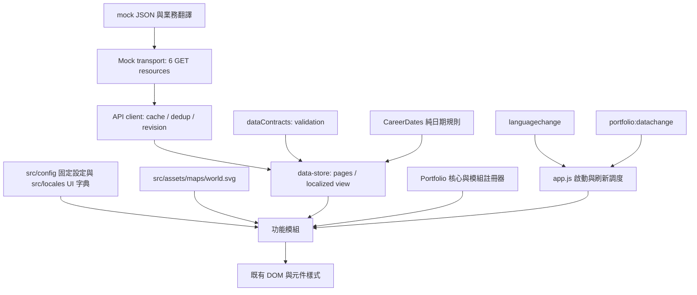

# 模組化、正規化與標準化說明

更新日期：2026-09-21。此文件對應已實作的靜態前端重構；完整功能仍以 [55 項功能清單](current-page-features.md) 為準。

## 1. 範圍與原則

本次保留既有頁面設計、三語、RWD、時間軸、地圖播放與離線能力，將「資料、計算、渲染、互動、調度」分開。採用 classic deferred script 與明確的模組註冊器；維護來源在 `src/`，由 Node 內建模組的建置程式組合成單一輸出。完整 `dist/` 仍可直接用 `file://` 開啟。

目前已有 6 支非同步 in-memory mock API，沒有 AJAX、HTTP server、資料庫或管理後台。業務資料統一在 mock/\*.json；API 版本與資料契約見 [api-interface-format.md](api-interface-format.md)。`data.replace()` 保留給集合快照匯入／測試（僅含 skills／skillCategories），正式接線入口改為 transport。

## 2. 重複性評估與處理

| 功能群         | 重複／耦合問題                                         | 本次處理                                                                          | 保留獨立的部分                                      |
| -------------- | ------------------------------------------------------ | --------------------------------------------------------------------------------- | --------------------------------------------------- |
| 導覽           | 名稱、錨點、圖示容易各自修改；手機開關混在主程式       | 保留 src/config/navigation.json 單一前端設定；抽出 mobileMenu                     | URL／歷史與抽屜開關分開                             |
| Overview／聯絡 | Email、地點、學位與頁尾重複固定文字                    | /site 集中聯絡內容；siteContent 從資料衍生摘要                                    | 個人 profile 是可編輯文案，不自動改寫敘述           |
| 實習對話框     | 桌面／手機需要相同內容、計時與狀態                     | chatme 共用流程；開關使用 core.disclosure                                         | 定位、3 秒倒數、hover 保持由此模組管理              |
| Journey        | 職涯、地圖點與選取狀態依索引綁定                       | Journey 直接取得地區與經緯度；選取用數字 id；journey 與 cityBubble 分責           | 地圖播放不抽象成一般輪播，城市 tooltip 不等同 modal |
| Experience     | 與 Journey 重複地點、公司、日期                        | Experience 使用 data.experiences 直接文字；與 Journey 共用數字 id、日期與圖示函式 | 經歷時間軸自己的視覺布局                            |
| Projects       | 摘要／dialog 內容重複；排序應遵從後端陣列              | content 共用模板；projects 管 dialog；collectionDisclosure 管集合展開             | 專案 dialog 保留原生 modal 焦點行為                 |
| Skills         | 四種位置各需標籤、計數、收合、寬度量測                 | skills 統一 tags／layout／capture／restore                                        | 各用途保有自己的穩定 owner ID                       |
| 多語言         | 英文散在資料檔與字典；切換時多處手動協調               | UI 與業務字典分離；i18n 提供翻譯，languageMenu 管選單，app 統一刷新               | 翻譯查找與選單互動不混在一起                        |
| 共用呈現       | frame 排程、開關狀態、SVG 建立、escaping、RWD 判斷重複 | core 共用小型 primitives；JS 手機模式讀 CSS token                                 | 不把所有互動做成巨大、參數眾多的通用元件            |

## 3. 分層與模組入口



| 檔案／註冊名稱                                                | 責任                                         | 公開入口與使用者                                                                                                                                                                                                                                                     |
| ------------------------------------------------------------- | -------------------------------------------- | -------------------------------------------------------------------------------------------------------------------------------------------------------------------------------------------------------------------------------------------------------------------- |
| `src/api/mock-transport.js`／MockPortfolioTransport           | JSON 的 API 投影、游標、關聯 include         | create(database, options).request({method,path,query})；測試可注入延遲與失敗                                                                                                                                                                                         |
| `src/api/client.js`／PortfolioApi                             | 同鍵去重、成功快取、revision 檢查            | request(path,query)、invalidate(path,query)、translate(locale)；store 使用                                                                                                                                                                                           |
| `src/features/pagination.js`／paging                          | 共用集合的 loading／retry／更多按鈕          | control(name)；content 使用，事件委派呼叫 data.loadPage                                                                                                                                                                                                              |
| `src/core/registry.js`／Portfolio                             | 註冊、相依解析、一次性初始化與 UI primitives | `register(name, dependencies, factory)`、`get(name)`、`start()`；所有功能使用                                                                                                                                                                                        |
| `mock/site/{locale}.json`／data.site                          | 完整當前語言的 API 內容，保持四個群組名稱    | siteContent、chatme                                                                                                                                                                                                                                                  |
| `src/config/runtime.json`／PORTFOLIO_RUNTIME                  | 純前端計時、技能比例、圖示與頁大小           | chatme、journey、skills、content                                                                                                                                                                                                                                     |
| `src/core/map-geometry.js`／MapGeometry                       | 共用 Mercator 投影、曲線及標籤布局           | `project(record)`、`route(a,b)`、`layoutLabels(svg,id)`；journey 使用                                                                                                                                                                                                |
| `src/core/category-icon.js`／CategoryIcon                     | 共用分類圖示                                 | `CategoryIcon(type)`；Experience 與城市浮框使用                                                                                                                                                                                                                      |
| `src/core/dates.js`／CareerDates                              | 純日期規則                                   | `validatePeriod`、`monthIndex`、`monthLabel`、`monthDuration`、`projectPeriod`、`labels`、`workDuration`                                                                                                                                                             |
| `src/core/data-contracts.js`／dataContracts                   | 純契約驗證，不修改快取或 DOM                 | validateSite、validateJourney、validate；由 store 委派，原有 data.validate／validateJourney 入口保留                                                                                                                                                                 |
| `src/core/store.js`／data                                     | 原樣局部語言資料、分頁與分類關聯             | site、journey、experiences、projects、replaceJourney、replaceExperiences、replaceProjects、validateJourney、validateExperiences、validateProjects、initialize、prepareLocale、page、loadPage、skillsState、loadSkills、snapshot、replace、validate、find、skillLabel |
| `src/core/i18n.js`／I18n                                      | 字典、偏好記憶與 DOM 靜態翻譯                | `locale`、`supported`、`options`、`t`、`applyStatic`、`setLoader`、非同步 `setLanguage`                                                                                                                                                                              |
| `src/core/icons.js`／Icons                                    | 本地可信 SVG 字典                            | `svg`、`mount`；由供應商同步腳本生成                                                                                                                                                                                                                                 |
| `src/features/navigation.js`／navigation                      | 錨點、scrollspy、舊網址與歷史                | 註冊時綁定事件；內部方法保持私有                                                                                                                                                                                                                                     |
| `src/features/mobile-menu.js`／mobileMenu                     | 手機抽屜                                     | `refresh()`；app 在翻譯／資料更新時呼叫                                                                                                                                                                                                                              |
| `src/features/language-menu.js`／languageMenu                 | 鍵盤可操作的語言選單                         | 註冊時綁定事件；呼叫 I18n.setLanguage                                                                                                                                                                                                                                |
| `src/features/stop-carousel.js`／carousel                     | 地點清單溢出、箭頭、滑動、焦點               | `refresh(keepSelected)`、`revealSelected(behavior)`                                                                                                                                                                                                                  |
| `src/features/skill-layout.js`／skills                        | 所有技能標籤的模板、尺寸與展開狀態           | `tags(items, owner)`、`layout`、`refresh`、`capture`、`restore`                                                                                                                                                                                                      |
| `src/features/render.js`／content                             | 純卡片模板與資料區塊渲染                     | `refresh()`、`projectDetail(project)`、`journeyStops(items)`                                                                                                                                                                                                         |
| `src/features/site-content.js`／siteContent                   | 同名 site 綁定、聯絡及資料衍生文字           | `refresh()`、`fullName(profile)`                                                                                                                                                                                                                                     |
| `src/features/chatme.js`／chatme                              | 實習資訊浮框及計時                           | `refresh()` 不重設倒數或開啟狀態                                                                                                                                                                                                                                     |
| `src/features/journey.js`／journey                            | 地圖幾何、選取與播放                         | `refresh()`、`select(careerId, manual)`、唯讀狀態快照 `state`                                                                                                                                                                                                        |
| `src/features/city-bubble.js`／cityBubble                     | 城市 tooltip、定位、關閉                     | `capture()`、`refresh(id)`、`hide()`；刷新前保存 ID，事件委派能承受 SVG 重建                                                                                                                                                                                         |
| `src/features/collection-disclosure.js`／collectionDisclosure | 經歷與專案共用展開、分頁、收合及焦點         | `render(options)`；由 content.refresh 呼叫                                                                                                                                                                                                                           |
| `src/features/projects.js`／projects                          | 原生 dialog、詳細資料與焦點還原              | `refresh()`；已刪除的選取專案會關閉 dialog                                                                                                                                                                                                                           |
| `src/app.js`                                                  | 唯一組合入口                                 | 啟動所有註冊模組，協調刷新與技能狀態還原                                                                                                                                                                                                                             |

公開入口的英文註解位於對應函式前。內部函式也有英文用途註解；事件 callback 由所屬模組及鄰近註解說明行為，不替每條賦值加入沒有資訊量的註解。

## 4. 正規化資料契約

data.site、data.journey、data.experiences、data.projects 分別按語言快取直接文字，key 與 API 完全一致。data.snapshot 僅保存 schemaVersion:1、skills、skillCategories。data.replace 僅供分類快照匯入；replaceJourney／replaceExperiences／replaceProjects 分別原子驗證和更新各資源。

| 集合            | 欄位與關係                                                                                                          |
| --------------- | ------------------------------------------------------------------------------------------------------------------- |
| projects        | 正整數 id、organizationName／Code／Title、專案日期、projectName／Title、intro、detail、skills；完整直接文字，無查表 |
| skills          | 字串 id、labelKey；技能分類的共用實體                                                                               |
| skillCategories | 字串 id、labelKey、skillIds；分類順序與技能關係                                                                     |

data.view 與舊 company／title／role 欄位別名已移除，無 organizations／countries／locations 資料表。原始記錄不做命名轉換。numbered 登記兩個資源的 cache／validator，definition 登記路由與分頁參數，都是功能調度而非欄位 mapping。

所有驗證在更新不可變快取前完成，失敗保留既有資料；語言切換先驗證 ID、順序與 total 再提交。詳見 [Projects 開發對照](projects-development.md)、[Experience 開發對照](experiences-development.md) 與 [API 契約](api-interface-format.md)。

### 衍生值維持單一計算來源

年資採工作月份聯集，包含起訖月；重疊月不重算，學校與空檔不算。專案期間亦含起訖月。已有 endMonth 的記錄按該月計算，不自動截斷至今天；版權年份是明確設定，沒有擅自改為裝置當年。

旅程筆數、首尾城市、最後國家、年資及經歷年份範圍由 data.journey 推導。專案剩餘未載入筆數為 page.total 減已載入數，收合入口為 total 減六筆預覽；不再有 meta.groups 或機構年份摘要。Experience／Projects 技能 +N 使用 skills.length 減可見數，分類使用 skillsPage.total 減可見數。profile 自然語言敘述由 mock/site 維護。

## 5. 調度與狀態規則

`Portfolio.register` 宣告相依；`Portfolio.start` 解析相依後只建立一次。禁止重複註冊名稱與循環相依。頁面刷新只呼叫 `refresh()`，不重新註冊 listener。

| 事件／階段           | 發出者                 | 處理者與順序                                                                                                                                                                                                          |
| -------------------- | ---------------------- | --------------------------------------------------------------------------------------------------------------------------------------------------------------------------------------------------------------------- |
| 初始載入             | `app.js`               | 還原前端語言偏好 → await data.initialize → I18n.setLoader(data.prepareLocale) → start → capture skills → applyStatic → content → siteContent → chatme → mobileMenu → journey → projects → cityBubble → restore skills |
| languagechange       | I18n.setLanguage       | prepareLocale 成功後才切換 locale／發事件；app 使用同一刷新順序；languageMenu 更新選中項；navigation 重新量測                                                                                                         |
| portfolio:datachange | data.loadPage／replace | app 使用同一刷新順序，已不存在的選取記錄退回有效狀態                                                                                                                                                                  |
| portfolio:maplayout  | journey.resize         | cityBubble 重新定位                                                                                                                                                                                                   |
| resize／字型完成     | DOM／FontFaceSet       | 各尺寸模組使用 rAF 排程，carousel 共用 observeLayout；skills 追蹤多個標籤列                                                                                                                                           |

地圖保留 `selectedId`、`elapsed`、`playing`；dialog 保留 project ID；城市 tooltip 在 DOM 重建前保存 career ID；技能以 `experience-{id}`、`project-{id}`、`dialog-{id}`、`category-{id}` 產生 owner ID。資料重排不會把選取／展開套到另一筆記錄。

空旅程會清除狀態、隱藏首尾摘要、停用播放控制；空專案不建立不存在的集合展開控制。側欄深層連結、語言偏好與 DOM 互動不由資料快照重置。

## 6. 程式標準

1. 所有維護中的 JS 模組提供英文檔頭及函式用途註解；資料檔提供契約說明，HTML／CSS 提供元件與布局說明。第三方 SVG path、字型與使用者原始素材保留原樣，不逐筆加入註解。
2. `.prettierrc.json` 規範 2 spaces、分號、雙引號及 trailing comma；原本壓成一行的程式／樣式展開為可讀格式。
3. DOM 字串內容統一經 `Portfolio.escape`；圖示只從本地 `Icons.svg` 產生。未接受任意 HTML 內容欄位。
4. 模組私有狀態留在 factory closure；跨模組使用明確 API，不讀取別的模組私有變數。
5. DOM 會重建的區域使用事件委派；Observer 釋放已拆除的技能群組，避免刷新後重複綁定。
6. CSS 由 `src/styles/index.css` 統一調度；`theme.css` 管理色彩、字型、主要尺寸與 motion tokens，`base.css` 管理預設與無障礙規則，`layout/` 管理骨架，`components/` 按責任管理互動與 RWD。時間軸 pulse 與像素浮框基底共用。`--mobile-layout` 是 JS 與 CSS 的共用 RWD 判斷來源，對話框 fadeMs 同時供應 CSS 與計時器。
7. 含語意差異的元件不硬併：原生 dialog、城市 tooltip、閒置自動關閉浮框只共用適合的 primitives。

## 7. 驗證與維護

不需安裝依賴即可執行純資料／模組測試：

```shell
node scripts/build.mjs
node scripts/test.mjs --unit
```

涵蓋三語鍵與插值、正常關聯、無效資料的原子拒絕、順序與地理資料一致、空集合、日期業務規則與模組只初始化一次。

瀏覽器驗證使用 `tests/browser.cjs`。開發環境需提供 Playwright 與 Chromium；可用 `PLAYWRIGHT_MODULE` 指定已安裝的套件路徑、`BROWSER_EXECUTABLE` 指定 Chrome／Edge 執行檔，再執行：

```shell
node scripts/test.mjs
```

測試使用離線模式，覆蓋全部專案的三語 dialog、ID 狀態還原、重排／空資料、同月跨群組、文字 escaping、30 組 RWD／語言、技能 3/4 寬度與時間軸對齊。Journey 專用測試涵蓋抵達高亮、暫停／重播、鍵盤 tooltip，以及 1／24 筆資料的滑動選單。導覽、對話框計時／首次顯示與 UI 互動已納入同一個 13 組回歸入口。逐項功能與測試對照見 [regression-coverage.md](regression-coverage.md)。

格式檢查使用 Prettier 3.6.2 與本專案設定；Prettier／Playwright 都是開發工具，不加入網頁執行時依賴。圖示更新仍由 `scripts/vendor-icons.mjs` 下載指定版本的官方資產，重新產生後再套用格式規範。

## 8. Mock API、分頁與未來邊界

- config/build.json 的 mock.files 登記 16 個業務 JSON；其中 mock/site、mock/journey、mock/experiences 與 mock/projects 各三份 JSON 保存直接語言內容；frontend 區另外登記 localization／navigation／runtime、UI 字典來源及靜態 SVG。scripts/lib/mock-data.mjs 分別載入後由 build 嵌入本地 app.js。mock transport 私有化資料庫，features 不碰原始 fixture。
- initialize 先取 /site，再取完整輕量 /journey，然後並行載入經歷、專案與分類的第一頁。所有 UI 在初始化完成後統一啟動。初始失敗提供重新載入入口。
- store 保留每個集合的 ids／total／nextCursor／hasMore／loading／error。pagechange 只更新載入控制；成功頁面再用 datachange 協調既有功能刷新。
- Projects 與 Experience 共用 page／size=6 追加模式；detail 與 skills 隨專案列表完整返回。無獨立詳情路由，失敗不推進頁碼。
- Experience／Projects 技能隨卡片完整返回；只有分類技能使用 cursor。shared skill 元件仍統一處理寬度預覽與展開；語言切換只重取已讀頁。
- client 去重與快取成功回應，store 合併前驗證；拒絕的 domain 回應逐出快取。revision 不同時拒絕混合並要求重新整理，不做背景跨版本合併。
- 完整 JSON 仍在離線 app.js，lazy 是 API 存取與 DOM 層級。正式 HTTP build 應換 transport 並停用完整 mock 嵌入，才降低下載量。沒有列表虛擬化。

下一階段只需在相同 request 契約下接 HTTP transport，無須讓每個 UI 自行 fetch。資料庫、CMS、認證、連線逾時、HTTP 快取、遠端離線快照仍待實作。每支 API 的 schema、排序、cursor 與錯誤格式見 [API 文件](api-interface-format.md)。

social 直接以 linkedin／github／medium／email 綁定入口。profile 直接提供文字與姓名／教育欄位；不再使用翻譯鍵或從 Journey 查詢教育摘要。

### 語言、固定設定與資料生命週期

`I18n` 在 API client 前初始化，從 src/config/localization.json 取得固定支援清單，再還原有效的 localStorage 偏好。PORTFOLIO_NAVIGATION 與 MAP_DATA 直接取前端建置資料，不由 /site 設定。沒有 cookie 或動態選單 API。

`data.initialize` 驗證並凍結 /site 的四個群組，存入 siteByLocale；data.site 回傳目前語言物件。PORTFOLIO_RUNTIME 由 build 直接提供前端設定，沒有 API 內容轉接或欄位別名。

`I18n.setLanguage` 先等待 loader；loader 經 PortfolioApi.translate 重放已成功取得的資源／cursor／owner，使用新 locale 與獨立快取。store 暫存並合併目標字典，再切換 UI；失敗不切換。切換期間新增的已讀資源會補齊，序號檢查避免晚到的舊選擇覆蓋最新語言。既有 ID、日期、排序不依語言變化，prepareLocale 更新業務字典及依 locale 快取的 site 直接文字，data.site 取得當前語言完整四個群組，保留分頁狀態。

翻譯鍵驗證接受目前已載入語言中的有效鍵，不要求第一次使用中文時先下載英文業務內容。固定英文 UI fallback 一直隨前端存在；其他 API 的業務字典缺譯由 transport 在目標語言回傳英文值；site／journey／experiences 只對整份支援語言物件缺失回退英文，已存在物件的必要欄位缺失會被 store 拒絕。維護測試仍檢查完整三語來源的鍵與插值一致性。

## Journey 的獨立資料與呈現

Journey 詳細原樣欄位對照見 [Journey 開發對照](journey-development.md)。`data.journey` 不經舊 company／short／role 轉接，mock transport 不讀 entities／業務字典。`MapGeometry` 只處理經緯度投影、曲線與標籤碰撞，`CategoryIcon` 共用 work／education 圖示。date／year／point 是元件內衍生值，沒有逐城市或 ID 轉換表。

前端原樣保留陣列順序，DOM attribute 的字串只在事件邊界轉成 Number。資料分類及日期由 Journey 提供年資計算；Experience 已改為直接三語內容及 page／size 分頁。

## 9. 來源、建置與發布邊界

- `config/build.json` 是 JavaScript 的唯一載入順序，模組 registry 仍檢查相依與循環。`src/index.html` 只有建置標記，不重複寫完整清單。
- CSS 的顏色常數已集中 theme；元件不寫 hex 色碼，build 契約測試會檢查。媒體查詢留在元件內並保留 cascade 語意，不利用全面 `!important` 解決拆分衝突。
- 產物保留 `Source:` 註記及英文註解，方便直接從 dist 除錯；修改仍回到來源後重新 build。
- `dist/build-manifest.json` 記錄穩定 SHA-256，不含時間戳。`build --check` 偵測漏建置與手改產物；打包只收 manifest 白名單。
- 建置只清除上一份 manifest 擁有、且本次不再產生的檔案；所有路徑先限制在輸出目錄內。不清空整個 dist；測試會攔截非 manifest 所有的多餘檔案。
- 測試、建置工具、文件與本機參考檔不載入瀏覽器；發布保持單純靜態網站。

### 技能標籤共用入口

Experience、Projects、專案詳情與 Skills 分類全部呼叫 `skills.tags(items, owner)`；標籤、展開按鈕、3/4 寬度量測、狀態及 lazy load 由 `src/features/skill-layout.js` 統一管理。展開圖示透過 `Icons.svg("plus-lg")` 使用本地 Bootstrap plus-lg SVG，收合使用 dash-lg；樣式集中於 `src/styles/components/skills.css`。新增使用位置應呼叫此入口，不另建標籤模板或展開事件。

### 滑鼠柔光模組

`src/features/pointer-glow.js` 註冊為 `pointerGlow`，沒有 API 或其他功能資料相依。共用 `Portfolio.frameTask` 將 pointermove 合併成每幀一次；只在可 hover 的精確滑鼠裝置且未開啟 reduced motion 時追蹤。離開視窗、失焦或頁面隱藏時淡出。`src/styles/components/pointer-glow.css` 使用 pointer-events: none 與 aria-hidden 裝飾圖層，避免影響點擊／焦點。色彩透明度與半徑由 theme.css 的 `--pointer-glow-color`、`--pointer-glow-radius` 統一調整；純 CSS 漸層不下載任何資源。

### 共用圖示呼吸效果

`src/styles/motion.css` 的 `icon-breathe` 供聊天圖示與經歷／專案展開圖示共用，以 SVG 輪廓 drop-shadow 為基礎，透過 CSS 參數控制明暗、顏色與縮放。Show more projects 使用 24px 圖示、2.4 秒週期、55% 至 100% 明暗與最高 1.18 倍縮放；尺寸／縮放／光暈由 theme.css 的 `--collection-icon-*` 控制，週期由 `--duration-icon-pulse` 控制，聊天圖示保留原強度，reduced motion 時保留靜態柔光；不新增計時器或網路資源。

### 經歷與專案共用集合展開元件

`src/features/collection-disclosure.js` 註冊 `collectionDisclosure`，依賴 data／paging／skills；`render` 接收同名的 id、collection、previewCount、total、title、collapseTitle、contentId、content。模組統一產生入口、數量、plus-circle-dotted 呼吸圖示、內容容器和收合按鈕，並管理原生 details toggle、第一次展開載入、錯誤重試邊界、快取重開及鍵盤焦點。`src/features/projects.js` 僅保留專案 dialog 行為，不再另外實作歷史展開。

Experience 的 previewCount 讀取 runtime.pagination.experiences（目前 6），與每頁 size 保持一致；remaining = page.total - previewCount。Projects 同樣使用 runtime.pagination.projects=6，無 earlier 分頁。每次展開最多觸發一頁請求，後續由 paging 按鈕明確載入；收合移除額外 DOM，但 data-store 保留記錄與 page（Experience／Projects）或 cursor（分類）。語言或資料刷新時，各自依穩定 id 保留 open 狀態。

`src/styles/components/collection-disclosure.css` 統一外觀、RWD 與呼吸圖示；Experience 的入口縮排使用既有 --experience-card-start，使卡片及加號區塊對齊。共用圖示 token 已命名為 --collection-icon-\*，不再使用只代表 Projects 的 history 前綴。

### 側欄品牌對齊

`src/styles/layout/navigation.css` 的 `.brand-heading` 以 flex 將品牌字樣與聊天按鈕作為一組，置中於側欄選單寬度內。手機仍使用獨立 mobile-header 排列；聊天浮框繼續量測按鈕實際位置決定箭頭與位置，沒有固定品牌座標。

## 背景與配色模組

`appearanceSettings` 為前端設定的單一來源，在 app 等待資料之前還原主題；`appearance` 與 `backgroundField` 訂閱 `portfolio:appearancechange`。前者只管理控制項，後者管理 SVG 幾何、動畫與進場；兩者不相互調用。色彩统一在 theme.css，三語文字在 src/locales。沒有新增 API 或業務 mapping table。完整 key、Cookie／file:// 策略與各檔案英文職責見 [appearance-development.md](appearance-development.md)。

### 初次進場與 chatme 的調度

chatme 宣告依賴 backgroundField，等待其一次性 `whenReady` Promise 後才開啟目前尺寸對應的浮框。側欄／手機導覽的完整表面在四邊定位後淡入；chatbox 再使用既有 fadeMs 淡入，完成後才啟動 idleMs。hover／focus 不會提前倒數，手動開關會取消尚未開始的首次自動顯示；一般重新開啟沿用既有互動計時。減少動態與略過進場均會完成 Promise，不會讓浮框永遠等待。

初始 HTML 使用 data-ready=false；background-field.css 在初次資料與 refresh 完成前隱藏 main、skip 與兩種導覽，保留布局量測與獨立錯誤／重試。app.js 僅在初次 refresh 完成後解除；field-entering 與 whenReady 延續原有責任。詳見 [冷啟動進場](appearance-development.md#cold-start-entrance--冷啟動進場2026-09-22)。

### 小螢幕導覽抽屜動畫

mobileMenu 只管理 open、aria-expanded、inert 及焦點；navigation.css 以 transform 與 opacity 處理進出動畫，visibility 延後至關閉動畫完成才隱藏。速度與曲線共用 theme.css 的 `--duration-drawer`（0.32s）及 `--ease-drawer`，不使用獨立關閉計時器；連續操作由 CSS transition 平順反轉。收合立即停用抽屜鍵盤存取，必要時焦點回到切換按鈕。跨越手機／桌面分界時清除抽屜狀態、恢復桌面導覽互動。系統減少動態效果時依共用規則立即切換。

### 桌面圖示列

sidebarRail 依賴 navigation 產生的連結，標題直接使用現有翻譯鍵；手機行為仍由 mobileMenu 管理。側欄、正文、背景共用 rail-width 與動畫 token，chatme 透過 observeLayout 跟隨寬度變動。詳見 [sidebar-navigation.md](sidebar-navigation.md)。

## 維護一致性檢查

`tests/maintenance.test.cjs` 隨 contracts 執行，檢查 project-structure 來源責任清單與函式索引、程式檔頭註解、CSS 唯一入口、未引用 token、Markdown 本地連結、JSON 範例及功能 ID 對照。完整稽核與保留資產理由見 [maintenance-audit.md](maintenance-audit.md)。錯誤提示使用前端 UI 字典，無須等待 API；navigation 同時處理資料早於／晚於 window.load 的初始化。

第 3 支詳細契約與欄位對照見 [Experience 開發文件](experiences-development.md)。skills.tags 共用布局，但 Experience 傳入直接文字，其他集合仍傳入 skillIds；不把直接文字轉回技能 ID。
